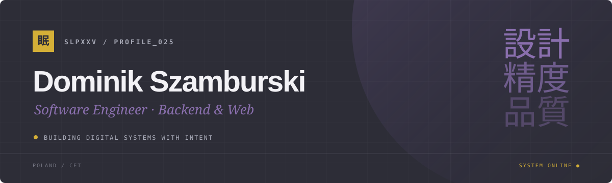

[Portfolio](https://slpxxv.github.io)　　[Repositories](https://github.com/slpxxv?tab=repositories)　　[Contact](https://github.com/slpxxv)

## 私について　/　About

Backend-focused software engineer from Poland, working across the entire web
stack. I turn complex requirements into reliable digital systems, with a strong
focus on clear architecture, maintainable code and thoughtful user experience.

I build and modernise web applications, backend APIs, integrations and
e-commerce systems using PHP, Symfony, TypeScript, React and Node.js.

`PHP`　`Symfony`　`TypeScript`　`React`　`Node.js`　`API`　`E-commerce`

 

> 技術は静かであるべき。— Technology should feel invisible.
